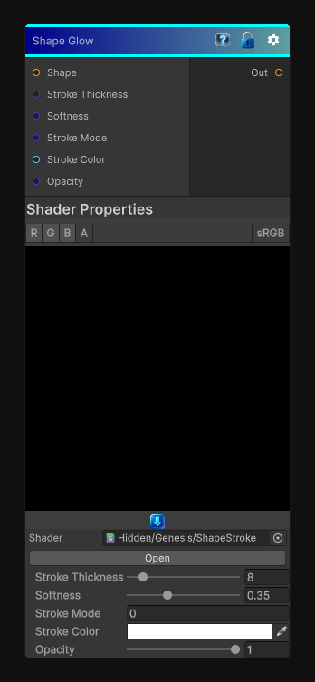

# Shape Glow

> This file is auto-generated by `Documentation/Generate-GenesisNodeDocs.ps1`.

[Back to index](../../README.md) | [Back to Effects](../../effects.md)

## Snapshot

## Details

- Menu: `Effects/Shape Stroke`
- Node group: `Effects`
- Shader: `Hidden/Genesis/ShapeStroke`
- Source: [Runtime/Nodes/Effects/Effects/ShapeStrokeNode.cs](../../../../Runtime/Nodes/Effects/Effects/ShapeStrokeNode.cs)

## Documentation

e deceptively simple nodes that actually does a very specific geometric operation:
- It generates an outline around a binary shape
- The outline has a thickness
- It has softness (feathering)
- It supports inner, outer, or both stroke modes
- It is distance-based, not blur-based
To recreate this in Genesis CRT, we have:
- A distance check around the shape
- A stroke band (inner/outer)
- A soft falloff
- A color + opacity
- Fully deterministic, CRT-safe sampling
