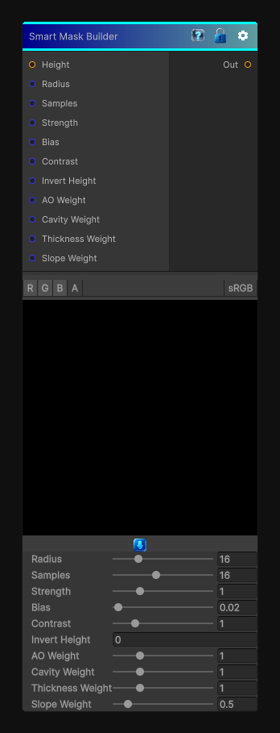

# Smart Mask Builder

> This file is auto-generated by `Documentation/Generate-GenesisNodeDocs.ps1`.

[Back to index](../../README.md) | [Back to Effects](../../effects.md)

## Snapshot

## Details

- Menu: `Effects/Smart Mask Builder`
- Shader: `Hidden/Genesis/SmartMaskSuite`
- Source: [Runtime/Nodes/Effects/Effects/SmartMaskBuilderNode.cs](../../../Doxygen/html/_smart_mask_builder_node_8cs_source.html)

## Documentation

Combines ambient occlusion, cavity, thickness, and slope cues into one reusable smart mask.

This is intended as a flexible mask-building node for:
- Edge wear
- Dirt, moss, and polish placement
- General material authoring workflows
