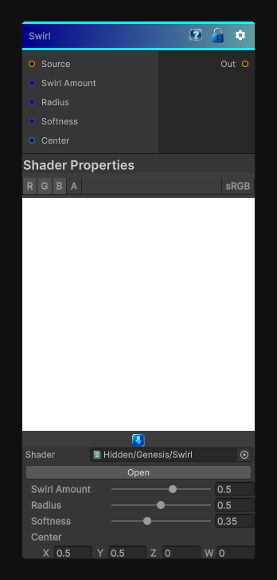

# Swirl

> This file is auto-generated by `Documentation/Generate-GenesisNodeDocs.ps1`.

[Back to index](../../README.md) | [Back to Effects](../../effects.md)

## Snapshot

## Details

- Menu: `Effects/Swirl`
- Node group: `Effects`
- Shader: `Hidden/Genesis/Swirl`
- Source: [Runtime/Nodes/Effects/Effects/SwirlNode.cs](../../../../Runtime/Nodes/Effects/Effects/SwirlNode.cs)

## Documentation

Swirl node is one of those classic 2D deformation operators: a radial rotation field centered on the UV, with a falloff so pixels near the center rotate more than pixels near the edge.
- Centered swirl
- Angle amount
- Radius
- Soft falloff
- Bidirectional rotation (positive/negative)
- Deterministic, CRT-safe sampling
