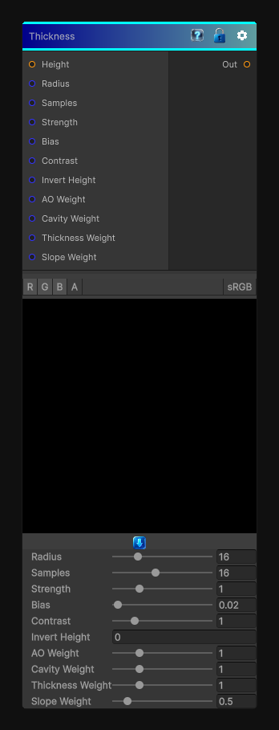

# Thickness

> This file is auto-generated by `Documentation/Generate-GenesisNodeDocs.ps1`.

[Back to index](../../README.md) | [Back to Effects](../../effects.md)

## Snapshot

## Details

- Menu: `Effects/Thickness`
- Shader: `Hidden/Genesis/SmartMaskSuite`
- Source: [Runtime/Nodes/Effects/Effects/ThicknessNode.cs](../../../Doxygen/html/_thickness_node_8cs_source.html)

## Documentation

Approximates local thickness and sheltered interior regions from a height field.

This node works well for:
- Moss and wetness placement
- Interior wear masks
- Protected-region selection
