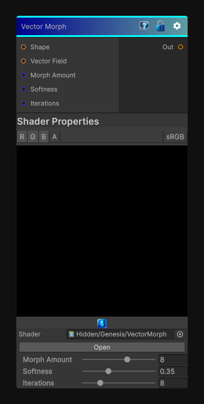

# Vector Morph

> This file is auto-generated by `Documentation/Generate-GenesisNodeDocs.ps1`.

[Back to index](../../README.md) | [Back to Effects](../../effects.md)

## Snapshot

## Details

- Menu: `Effects/Vector Morph`
- Node group: `Effects`
- Shader: `Hidden/Genesis/VectorMorph`
- Source: [Runtime/Nodes/Effects/Effects/VectorMorphNode.cs](../../../../Runtime/Nodes/Effects/Effects/VectorMorphNode.cs)

## Documentation

Vector Morph is one of the most elegant shape-processing nodes in the entire library. It takes a shape mask and a vector field, and it pushes the shape outward or inward according to that vector field - essentially a vector-guided dilation/erosion.
It's not a warp.
It's not a blur.
It's not a directional transform.
It is a morphological expansion driven by a vector map.
It has:
- - A vector map (RG = XY direction)
- - A shape mask
- - A morph amount
- - A softness
- - A distance-based falloff
- - Deterministic, CRT-safe sampling
