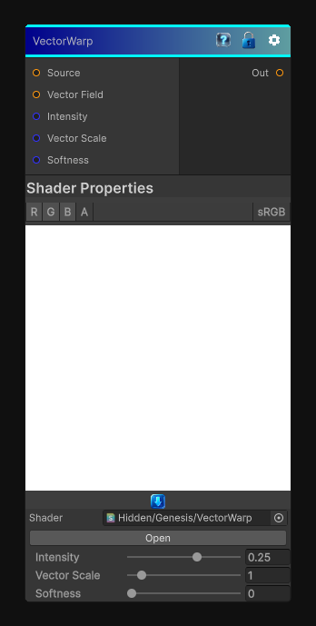

# VectorWarp

> This file is auto-generated by `Documentation/Generate-GenesisNodeDocs.ps1`.

[Back to index](../../README.md) | [Back to Effects](../../effects.md)

## Snapshot

## Details

- Menu: `Effects/Vector Warp`
- Node group: `Effects`
- Shader: `Hidden/Genesis/VectorWarp`
- Source: [Runtime/Nodes/Effects/Effects/VectorWarpNode.cs](../../../../Runtime/Nodes/Effects/Effects/VectorWarpNode.cs)

## Documentation

Vector Warp is one of the cleanest and most useful deformation nodes in the whole library. Unlike Vector Morph (which grows the shape along a vector field), Vector Warp actually warps the UVs using a vector map.
Think of it as:
- A UV displacement
- Driven by a vector field (RG = XY)
- With intensity
- With scale
- With optional falloff
- Fully per-pixel
