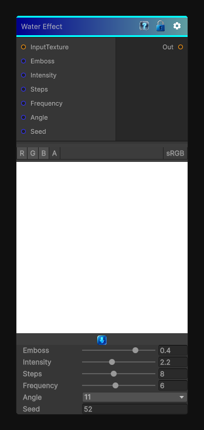

# Water Effect

> This file is auto-generated by `Documentation/Generate-GenesisNodeDocs.ps1`.

[Back to index](../../README.md) | [Back to Effects](../../effects.md)

## Snapshot

## Details

- Menu: `Effects/Water Effect`
- Node group: `Effects`
- Shader: `Hidden/Genesis/WaterEffect`
- Source: [Runtime/Nodes/Effects/Effects/WaterEffectNode.cs](../../../Doxygen/html/_water_effect_node_8cs_source.html)

## Documentation

Applies the existing water ripple distortion shader as a surfaced Genesis node.

Use it for:
- Ripples and refractive wobble
- Heat-haze style distortion
- Stylized liquid surface motion
