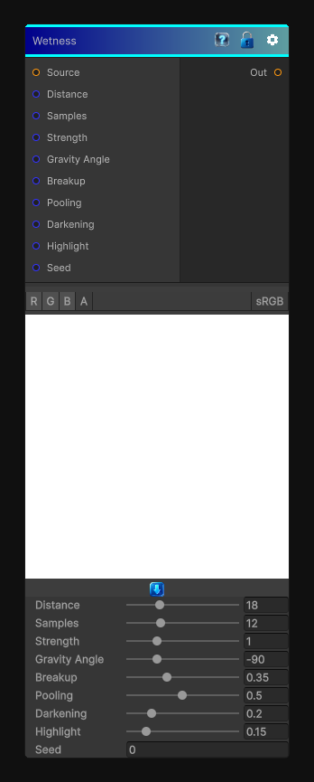

# Wetness

> This file is auto-generated by `Documentation/Generate-GenesisNodeDocs.ps1`.

[Back to index](../../README.md) | [Back to Effects](../../effects.md)

## Snapshot

## Details

- Menu: `Effects/Wetness`
- Shader: `Hidden/Genesis/FlowEffectSuite`
- Source: [Runtime/Nodes/Effects/Effects/WetnessNode.cs](../../../Doxygen/html/_wetness_node_8cs_source.html)

## Documentation

Darkens and softens the source using a derived flow and pooling mask to suggest wet material.

This is a good fit for:
- Puddled surfaces
- Damp streaks
- Rain-darkened materials
