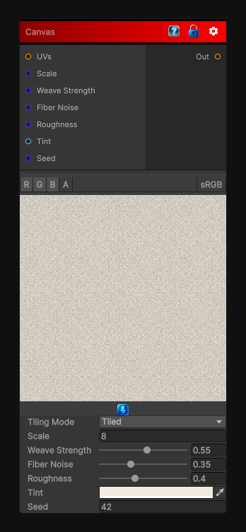

# Canvas

> This file is auto-generated by `Documentation/Generate-GenesisNodeDocs.ps1`.

[Back to index](../../README.md) | [Back to Filters](../../filters.md)

## Snapshot

## Details

- Menu: `Filters/Artistic/Canvas`
- Node group: `Artistic`
- Shader: `Hidden/Genesis/CanvasTexture`
- Source: [Runtime/Nodes/Filters/Artistic/CanvasNode.cs](../../../Doxygen/html/_canvas_node_8cs_source.html)

## Documentation

- Paper/canvas fiber grain
- Directional weave (warp/weft)
- Micro-roughness
- Pigment catch (paint settling into fibers)
- Optional color tinting
