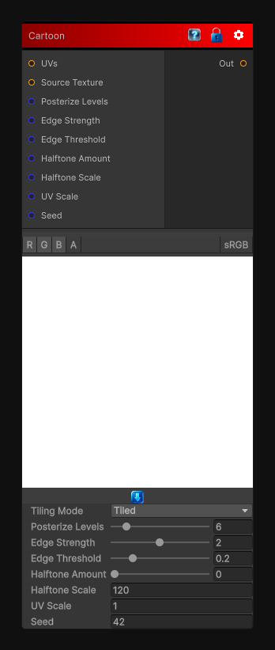

# Cartoon

> This file is auto-generated by `Documentation/Generate-GenesisNodeDocs.ps1`.

[Back to index](../../README.md) | [Back to Filters](../../filters.md)

## Snapshot

## Details

- Menu: `Filters/Artistic/Cartoon`
- Node group: `Artistic`
- Shader: `Hidden/Genesis/CartoonFilter`
- Source: [Runtime/Nodes/Filters/Artistic/CartoonFilterNode.cs](../../../Doxygen/html/_cartoon_filter_node_8cs_source.html)

## Documentation

- Edge detection (Sobel-style)
- Color quantization (toon shading)
- Posterization
- Optional halftone dots
