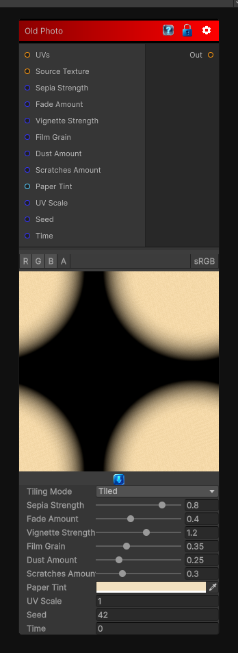

# Old Photo

> This file is auto-generated by `Documentation/Generate-GenesisNodeDocs.ps1`.

[Back to index](../../README.md) | [Back to Filters](../../filters.md)

## Snapshot

## Details

- Menu: `Filters/Artistic/Old Photo`
- Node group: `Artistic`
- Shader: `Hidden/Genesis/OldPhotoFilter`
- Source: [Runtime/Nodes/Filters/Artistic/OldPhotoNode.cs](../../../Doxygen/html/_old_photo_node_8cs_source.html)

## Documentation

- Sepia toning
- Film fade & contrast loss
- Paper yellowing
- Vignette darkening
- Film grain
- Dust & scratches
- Edge wear
