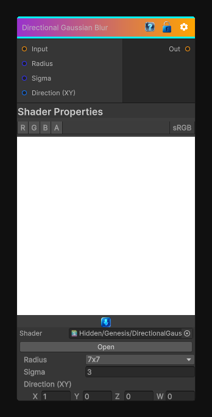

# Directional Gaussian Blur

> This file is auto-generated by `Documentation/Generate-GenesisNodeDocs.ps1`.

[Back to index](../../README.md) | [Back to Filters](../../filters.md)

## Snapshot

## Details

- Menu: `Filters/Blur/Directional Gaussian Blur`
- Node group: `Blur`
- Shader: `Hidden/Genesis/DirectionalGaussianBlur`
- Source: [Runtime/Nodes/Filters/Blur/DirectionalGaussianBlurNode.cs](../../../../Runtime/Nodes/Filters/Blur/DirectionalGaussianBlurNode.cs)

## Documentation

Blur the input texture using a Gaussian filter in the specified direction.

Note that the kernel uses a fixed number of 32 samples, for high blur radius you may need to use two directional blur nodes.
