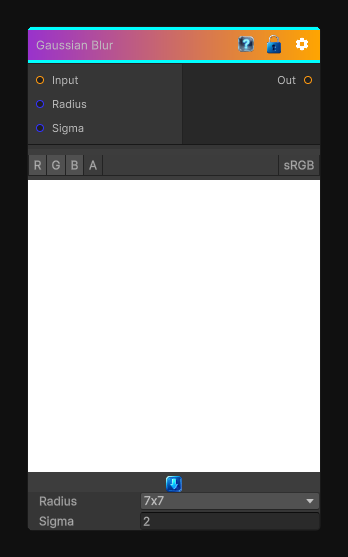

# Gaussian Blur

> This file is auto-generated by `Documentation/Generate-GenesisNodeDocs.ps1`.

[Back to index](../../README.md) | [Back to Filters](../../filters.md)

## Snapshot

## Details

- Menu: `Filters/Blur/Gaussian Blur`
- Node group: `Blur`
- Shader: `Hidden/Genesis/GaussianBlur`
- Source: [Runtime/Nodes/Filters/Blur/GaussianBlurNode.cs](../../../Doxygen/html/_gaussian_blur_node_8cs_source.html)

## Documentation

Multi-Kernel size Gaussian blur
