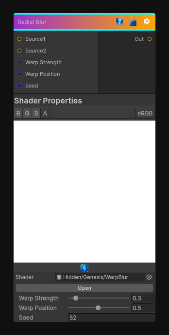

# Radial Blur

> This file is auto-generated by `Documentation/Generate-GenesisNodeDocs.ps1`.

[Back to index](../../README.md) | [Back to Filters](../../filters.md)

## Snapshot

## Details

- Menu: `Filters/Blur/Warp Blur`
- Node group: `Blur`
- Shader: `Hidden/Genesis/WarpBlur`
- Source: [Runtime/Nodes/Filters/Blur/WarpBlur.cs](../../../../Runtime/Nodes/Filters/Blur/WarpBlur.cs)

## Documentation

A warp like blur between 2 input textures.
