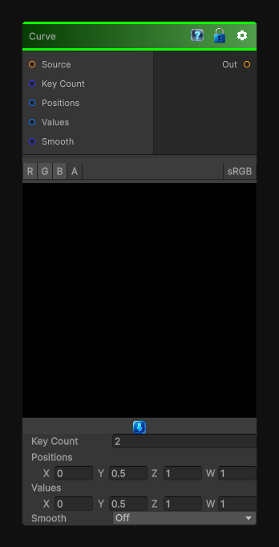

# Curve

> This file is auto-generated by `Documentation/Generate-GenesisNodeDocs.ps1`.

[Back to index](../../README.md) | [Back to Filters](../../filters.md)

## Snapshot

## Details

- Menu: `Filters/Curve`
- Node group: `Transforms`
- Shader: `Hidden/Genesis/Curve`
- Source: [Runtime/Nodes/Filters/CurveNode.cs](../../../Doxygen/html/_curve_node_8cs_source.html)

## Documentation

- Curve remapping
- Supports grayscale and color
- Sorted key interpolation
- Smooth or linear interpolation
