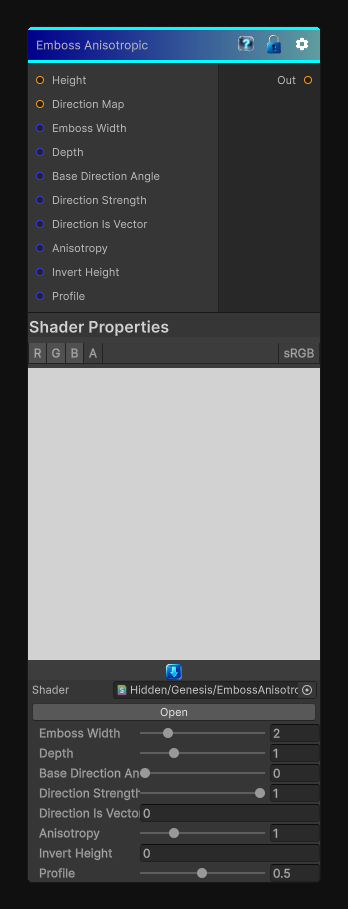

# Emboss Anisotropic

> This file is auto-generated by `Documentation/Generate-GenesisNodeDocs.ps1`.

[Back to index](../../README.md) | [Back to Filters](../../filters.md)

## Snapshot

## Details

- Menu: `Filters/Distort/Emboss Anisotropic`
- Node group: `Effects`
- Shader: `Hidden/Genesis/EmbossAnisotropic`
- Source: [Runtime/Nodes/Filters/Distort/EmbossAnisotropicNode.cs](../../../../Runtime/Nodes/Filters/Distort/EmbossAnisotropicNode.cs)

## Documentation

- Emboss direction guided by a direction map
- Optional structure-tensor anisotropy (auto-flow)
- Height-based embossing
- Width, depth, profile shaping
- Direction strength blending
