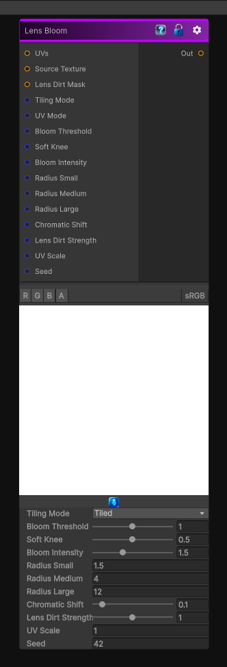

# Lens Bloom

> This file is auto-generated by `Documentation/Generate-GenesisNodeDocs.ps1`.

[Back to index](../../README.md) | [Back to Filters](../../filters.md)

## Snapshot

## Details

- Menu: `Filters/Distort/Lens Bloom`
- Node group: `Operations`
- Shader: `Hidden/Genesis/LensBloom`
- Source: [Runtime/Nodes/Filters/Distort/LensBloom.cs](../../../Doxygen/html/_lens_bloom_8cs_source.html)

## Documentation

- Soft, cinematic bloom
- Thresholded bright-pass
- Multi-radius Gaussian glow
- Chromatic fringing
- Lens dirt scattering
- Physically-inspired bloom rolloff
