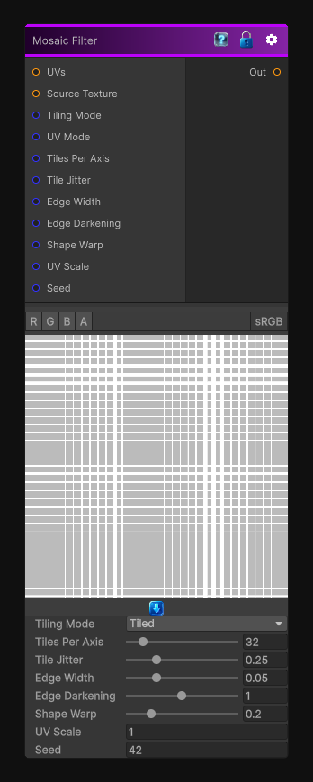

# Mosaic Filter

> This file is auto-generated by `Documentation/Generate-GenesisNodeDocs.ps1`.

[Back to index](../../README.md) | [Back to Filters](../../filters.md)

## Snapshot

## Details

- Menu: `Filters/Distort/Mosaic Filter`
- Node group: `Operations`
- Shader: `Hidden/Genesis/MosaicFilter`
- Source: [Runtime/Nodes/Filters/Distort/MosaicNode.cs](../../../Doxygen/html/_filters_2_distort_2_mosaic_node_8cs_source.html)

## Documentation

Pixelates the input into square tiles
Adds per-tile jitter for organic variation
Adds tile shape warp for a hand-drawn look
Adds edge darkening for stained-glass / mosaic grout
Fully procedural and deterministic
