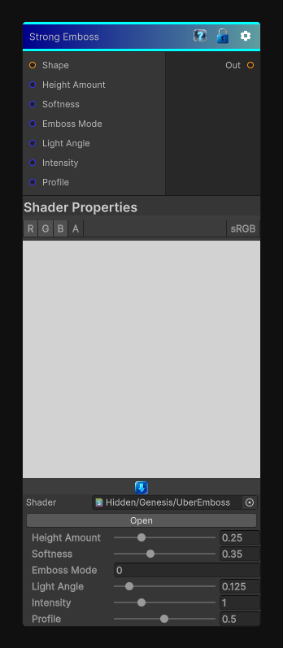

# Strong Emboss

> This file is auto-generated by `Documentation/Generate-GenesisNodeDocs.ps1`.

[Back to index](../../README.md) | [Back to Filters](../../filters.md)

## Snapshot

## Details

- Menu: `Filters/Distort/Strong Emboss`
- Node group: `Effects`
- Shader: `Hidden/Genesis/UberEmboss`
- Source: [Runtime/Nodes/Filters/Distort/StrongEmbossNode.cs](../../../../Runtime/Nodes/Filters/Distort/StrongEmbossNode.cs)

## Documentation

Strong Emboss is one of the most feature-rich shape-to-height operators in the entire library. It's basically a unified emboss engine that blends:
- Bevel
- Emboss
- Inner/Outer height offsets
- Softness
- Height profile shaping
- Light direction
- Intensity
- Distance-based falloff
To recreate this in Genesis CRT, we need to build a height-from-shape gradient solver with:
- Normal-style gradient from the shape mask
- Light direction
- Height profile curve
- Inner/outer emboss
- Softness (feathering)
- Intensity
- Deterministic, CRT-safe sampling
