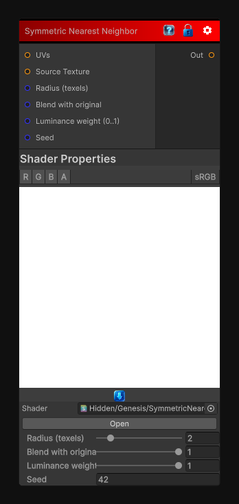

# Symmetric Nearest Neighbor

> This file is auto-generated by `Documentation/Generate-GenesisNodeDocs.ps1`.

[Back to index](../../README.md) | [Back to Filters](../../filters.md)

## Snapshot

## Details

- Menu: `Filters/Enhance/Symmetric Nearest Neighbor`
- Shader: `Hidden/Genesis/SymmetricNearestNeighbor`
- Source: [Runtime/Nodes/Filters/Enhance/SymmetricNearestNeighborNode.cs](../../../../Runtime/Nodes/Filters/Enhance/SymmetricNearestNeighborNode.cs)

## Documentation

symmetric nearest-neighbor smoothing filter. For each symmetric pair of samples (left/right and up/down) at each radius step the shader picks the sample that is closer in luminance to the center (nearest neighbor in appearance) and accumulates those chosen samples. This preserves edges and fine detail better than a naive box blur while still removing high-frequency noise.
