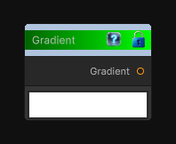

# Gradient

> This file is auto-generated by `Documentation/Generate-GenesisNodeDocs.ps1`.

[Back to index](../../README.md) | [Back to Function](../../function.md)

## Snapshot

## Details

- Menu: `Function/Constant/Gradient`
- Node group: `Constant`
- Source: [Runtime/Nodes/Functions/Constants/GradientNode.cs](../../../Doxygen/html/_gradient_node_8cs_source.html)

## Documentation

Outputs a constant gradient value.
