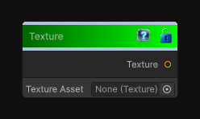

# Texture

> This file is auto-generated by `Documentation/Generate-GenesisNodeDocs.ps1`.

[Back to index](../../README.md) | [Back to Function](../../function.md)

## Snapshot

## Details

- Menu: `Function/Constant/Texture`
- Node group: `Constant`
- Source: [Runtime/Nodes/Functions/Constants/TextureNode.cs](../../../../Runtime/Nodes/Functions/Constants/TextureNode.cs)

## Documentation

The Texture node can accept any type of texture in parameter (2D, 3D, 2DArray, Cube, CubeArray, RenderTexture).
The output type of the node will update according to the type of texture provided. In case the texture type changes, the output edges may be destroyed.
