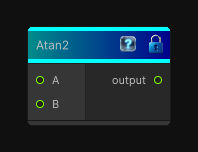

# Atan2

> This file is auto-generated by `Documentation/Generate-GenesisNodeDocs.ps1`.

[Back to index](../../README.md) | [Back to Function](../../function.md)

## Snapshot

## Details

- Menu: `Function/Math/Atan2`
- Node group: `Math`
- Source: [Runtime/Nodes/Functions/Math/Atan2Node.cs](../../../Doxygen/html/_atan2_node_8cs_source.html)

## Documentation

Returns the arctangent of A / B while preserving the quadrant.
