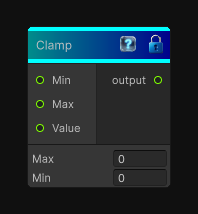

# Clamp

> This file is auto-generated by `Documentation/Generate-GenesisNodeDocs.ps1`.

[Back to index](../../README.md) | [Back to Function](../../function.md)

## Snapshot

## Details

- Menu: `Function/Math/Clamp`
- Node group: `Math`
- Source: [Runtime/Nodes/Functions/Math/ClampNode.cs](../../../Doxygen/html/_clamp_node_8cs_source.html)

## Documentation

Clamps the input to a specified range.
