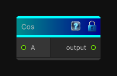

# Cos

> This file is auto-generated by `Documentation/Generate-GenesisNodeDocs.ps1`.

[Back to index](../../README.md) | [Back to Function](../../function.md)

## Snapshot

## Details

- Menu: `Function/Math/Cos`
- Node group: `Math`
- Source: [Runtime/Nodes/Functions/Math/CosNode.cs](../../../../Runtime/Nodes/Functions/Math/CosNode.cs)

## Documentation

Returns the cosine of the input.
