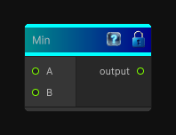

# Min

> This file is auto-generated by `Documentation/Generate-GenesisNodeDocs.ps1`.

[Back to index](../../README.md) | [Back to Function](../../function.md)

## Snapshot

## Details

- Menu: `Function/Math/Min`
- Node group: `Math`
- Source: [Runtime/Nodes/Functions/Math/MinNode.cs](../../../Doxygen/html/_min_node_8cs_source.html)

## Documentation

Returns the smaller of the input values.
