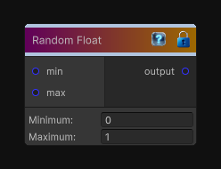

# Random Float

> This file is auto-generated by `Documentation/Generate-GenesisNodeDocs.ps1`.

[Back to index](../../README.md) | [Back to Function](../../function.md)

## Snapshot

## Details

- Menu: `Function/Random/Float`
- Node group: `Random`
- Source: [Runtime/Nodes/Functions/Random/RandomFloatNode.cs](../../../Doxygen/html/_random_float_node_8cs_source.html)

## Documentation

Generates a random float value.
