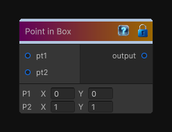

# Point in Box

> This file is auto-generated by `Documentation/Generate-GenesisNodeDocs.ps1`.

[Back to index](../../README.md) | [Back to Function](../../function.md)

## Snapshot

## Details

- Menu: `Function/Random/Point in Box`
- Node group: `Random`
- Source: [Runtime/Nodes/Functions/Random/RandomPointInBoxNode.cs](../../../Doxygen/html/_random_point_in_box_node_8cs_source.html)

## Documentation

Generates a random point inside a box.
