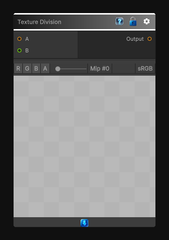

# Texture Division

> This file is auto-generated by `Documentation/Generate-GenesisNodeDocs.ps1`.

[Back to index](../../README.md) | [Back to Function](../../function.md)

## Snapshot

## Details

- Menu: `Function/Texture/Texture Division`
- Node group: `Texture`
- Source: [Runtime/Nodes/Functions/Textures/DivideTexture.cs](../../../Doxygen/html/_divide_texture_8cs_source.html)

## Documentation

Divides one texture input by another per pixel.
