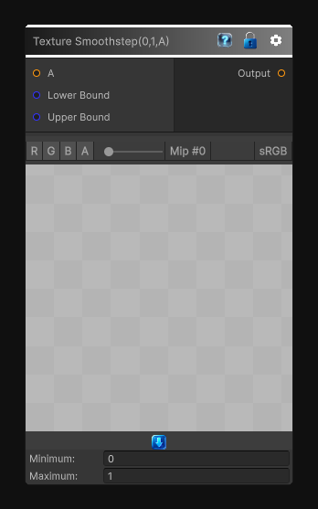

# Texture Smoothstep(0,1,A)

> This file is auto-generated by `Documentation/Generate-GenesisNodeDocs.ps1`.

[Back to index](../../README.md) | [Back to Function](../../function.md)

## Snapshot

## Details

- Menu: `Function/Texture/Texture Smoothstep(0,1,A)`
- Node group: `Texture`
- Source: [Runtime/Nodes/Functions/Textures/SmoothStepTexture.cs](../../../Doxygen/html/_smooth_step_texture_8cs_source.html)

## Documentation

Applies `Smoothstep(0,1,A)` to the source texture per pixel.
