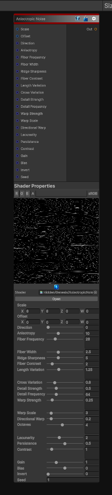

# Anisotropic Noise

> This file is auto-generated by `Documentation/Generate-GenesisNodeDocs.ps1`.

[Back to index](../../README.md) | [Back to Generators](../../generators.md)

## Snapshot

## Details

- Menu: `Generators/Noise/Anisotropic Noise`
- Node group: `Noise`
- Shader: `Hidden/Genesis/AnisotropicNoise`
- Source: [Runtime/Nodes/Generator/Noise/AnisotropicNoiseNode.cs](../../../../Runtime/Nodes/Generator/Noise/AnisotropicNoiseNode.cs)

## Documentation

Anisotropic noise with a controllable direction vector, anisotropy amount, and optional rotation. This noise type produces stretched patterns along the specified direction, ideal for simulating:
- Wind-blown surfaces
- Flowing water
- Motion blur effects
