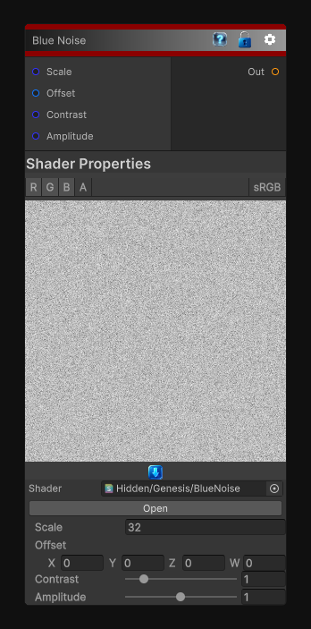

# Blue Noise

> This file is auto-generated by `Documentation/Generate-GenesisNodeDocs.ps1`.

[Back to index](../../README.md) | [Back to Generators](../../generators.md)

## Snapshot

## Details

- Menu: `Generators/Noise/Blue Noise`
- Shader: `Hidden/Genesis/BlueNoise`
- Source: [Runtime/Nodes/Generator/Noise/BlueNoise.cs](../../../../Runtime/Nodes/Generator/Noise/BlueNoise.cs)

## Documentation

The BlueNoise node generates deterministic, sampler-free blue-noise-style masks in 2D, 3D, or Cube space.
Blue noise suppresses low-frequency clustering and keeps randomness concentrated in fine detail, making it useful for:
- Dithering
- Stochastic sampling
- Procedural scattering
- Pattern breakup
- Anti-aliasing
- Poisson-like distributions
The node supports frequency, seed, output range, tiling, custom UVs, and multi-channel evaluation.
