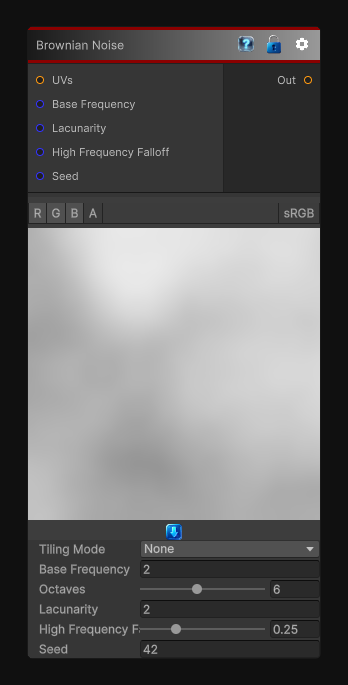

# Brownian Noise

> This file is auto-generated by `Documentation/Generate-GenesisNodeDocs.ps1`.

[Back to index](../../README.md) | [Back to Generators](../../generators.md)

## Snapshot

## Details

- Menu: `Generators/Noise/Brownian Noise`
- Shader: `Hidden/Genesis/BrownianNoise`
- Source: [Runtime/Nodes/Generator/Noise/BrownianNoise.cs](../../../Doxygen/html/_brownian_noise_8cs_source.html)

## Documentation

The BrownianNoise node generates deterministic, sampler-free Brownian noise in 2D, 3D, or Cube space.
Brownian noise strongly favors lower frequencies, producing broad smooth variation with subdued fine detail. It is useful for:
- Large terrain and cloud forms
- Soft erosion and weathering masks
- Organic clustered breakup
- Slow material variation
- Low-frequency procedural displacement
The node supports frequency, octaves, lacunarity, high-frequency falloff, seed, output range, tiling, custom UVs, and multi-channel evaluation.
