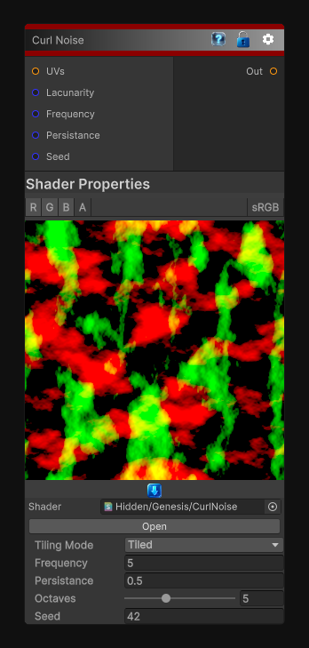

# Curl Noise

> This file is auto-generated by `Documentation/Generate-GenesisNodeDocs.ps1`.

[Back to index](../../README.md) | [Back to Generators](../../generators.md)

## Snapshot

## Details

- Menu: `Generators/Noise/Curl Noise`
- Node group: `Noise`
- Shader: `Hidden/Genesis/CurlNoise`
- Source: [Runtime/Nodes/Generator/Noise/CurlNoise.cs](../../../../Runtime/Nodes/Generator/Noise/CurlNoise.cs)

## Documentation

The CurlNoise node generates 2D or 3D curl noise derived from Perlin FBM.
Curl noise is divergencea'free, meaning it produces swirling, fluida'like vector fields with no sinks or sources. This makes it ideal for:
- Flow maps
- Smoke, fire, and fluid motion
- Stylized wind fields
- Particle advection
- Organic distortion fields
- Procedural animation
The node outputs a vector field (XYZ), not scalar noise
