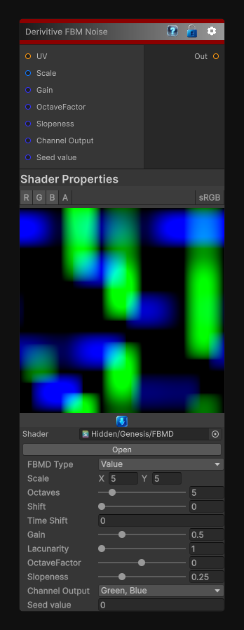

# Derivitive FBM Noise

> This file is auto-generated by `Documentation/Generate-GenesisNodeDocs.ps1`.

[Back to index](../../README.md) | [Back to Generators](../../generators.md)

## Snapshot

## Details

- Menu: `Generators/Noise/Derivative FBM`
- Node group: `Noise`
- Shader: `Hidden/Genesis/FBMD`
- Source: [Runtime/Nodes/Generator/Noise/FBMDNoise.cs](../../../../Runtime/Nodes/Generator/Noise/FBMDNoise.cs)

## Documentation

The FBMD node generates multia'dimensional fractal noise, outputting three correlated channels (X, Y, Z).
It supports two base noise types:
- Value FBMD
- Perlin FBMD
Unlike standard FBM, which outputs a single scalar, FBMD produces a vectora'like triple of fractal values.
This makes it ideal for:
- Vector displacement
- Flow fields
- Stylized normals
- Multia'channel masks
- Procedural breakup
- Organic motion fields
- Terrain and material layering
The node also includes slopeness, a unique parameter that shapes the directional bias of the fractal layers.
