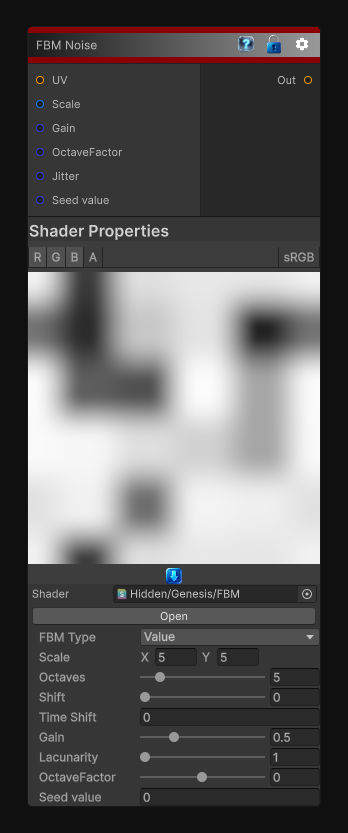

# FBM Noise

> This file is auto-generated by `Documentation/Generate-GenesisNodeDocs.ps1`.

[Back to index](../../README.md) | [Back to Generators](../../generators.md)

## Snapshot

## Details

- Menu: `Generators/Noise/FBM`
- Node group: `Noise`
- Shader: `Hidden/Genesis/FBM`
- Source: [Runtime/Nodes/Generator/Noise/FBMNoise.cs](../../../../Runtime/Nodes/Generator/Noise/FBMNoise.cs)

## Documentation

The FBM node generates fractal noise by layering multiple octaves of a base noise function.
Unlike traditional FBM nodes, this version supports five distinct FBM types, each with its own parameters and behaviors:
- Value FBM
- Perlin FBM
- Voronoi FBM
- Grid FBM
- Meatball FBM (metaballa'based)
This makes the node extremely versatile for:
- Terrain
- Clouds
- Stylized materials
- Organic patterns
- Domaina'warped textures
- Masks and breakup layers
- Procedural animation
