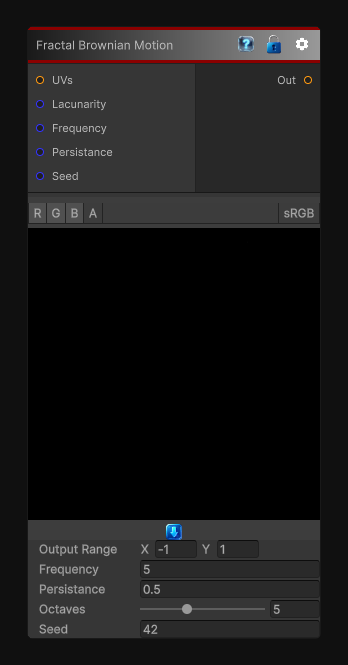

# Fractal Brownian Motion

> This file is auto-generated by `Documentation/Generate-GenesisNodeDocs.ps1`.

[Back to index](../../README.md) | [Back to Generators](../../generators.md)

## Snapshot

## Details

- Menu: `Generators/Noise/Fractal Brownian Motion`
- Node group: `Noise`
- Shader: `Hidden/Genesis/FractalBrownianMotionNoise`
- Source: [Runtime/Nodes/Generator/Noise/FractalBrownianMotionNoiseNode.cs](../../../Doxygen/html/_fractal_brownian_motion_noise_node_8cs_source.html)

## Documentation

Generates classic fractal Brownian motion noise by layering Perlin noise across multiple octaves.

Use this node when you want a simpler, dedicated FBM generator with direct control over frequency, octaves, persistence, lacunarity, seed, and output range.
