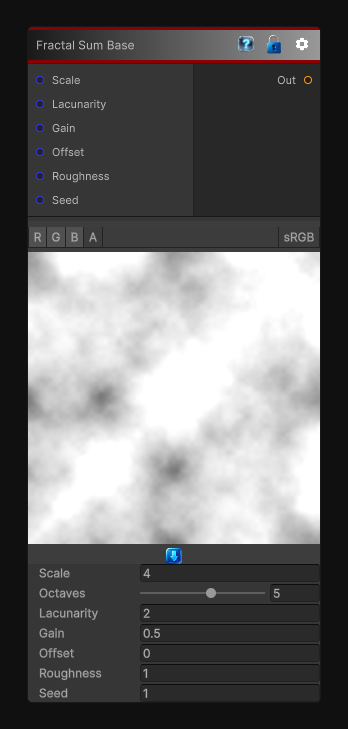

# Fractal Sum Base

> This file is auto-generated by `Documentation/Generate-GenesisNodeDocs.ps1`.

[Back to index](../../README.md) | [Back to Generators](../../generators.md)

## Snapshot

## Details

- Menu: `Generators/Noise/Fractal Sum Base`
- Node group: `Noise`
- Shader: `Hidden/Genesis/FractalSumBase`
- Source: [Runtime/Nodes/Generator/Noise/FractalSumBaseNode.cs](../../../Doxygen/html/_fractal_sum_base_node_8cs_source.html)

## Documentation

A configurable multi-octave fractal noise engine
with controls for:
octaves, lacunarity, gain, offset, amplitude, roughness, and seed.
