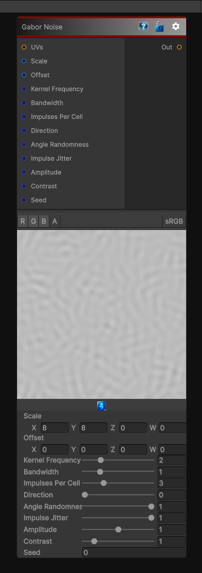

# Gabor Noise

> This file is auto-generated by `Documentation/Generate-GenesisNodeDocs.ps1`.

[Back to index](../../README.md) | [Back to Generators](../../generators.md)

## Snapshot

## Details

- Menu: `Generators/Noise/Gabor Noise`
- Node group: `Noise`
- Shader: `Hidden/Genesis/GaborNoise`
- Source: [Runtime/Nodes/Generator/Noise/GaborNoiseNode.cs](../../../Doxygen/html/_gabor_noise_node_8cs_source.html)

## Documentation

Sparse-convolution Gabor noise for brushed, fibrous, scratchy, and directional surface breakup.

Gabor noise is especially useful as a foundational material primitive because it can cover:
- Fibers and hairline streaks
- Brushed metal and anisotropic breakup
- Paper, cloth, and directional grain
- Scratch masks and fine weathering detail
