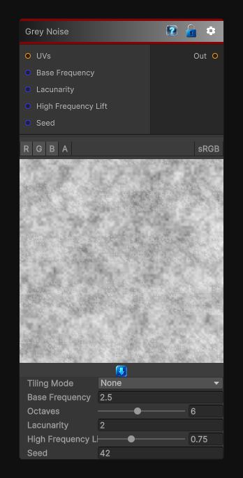

# Grey Noise

> This file is auto-generated by `Documentation/Generate-GenesisNodeDocs.ps1`.

[Back to index](../../README.md) | [Back to Generators](../../generators.md)

## Snapshot

## Details

- Menu: `Generators/Noise/Grey Noise`
- Shader: `Hidden/Genesis/GreyNoise`
- Source: [Runtime/Nodes/Generator/Noise/GreyNoise.cs](../../../Doxygen/html/_grey_noise_8cs_source.html)

## Documentation

The GreyNoise node generates deterministic, sampler-free grey noise in 2D, 3D, or Cube space.
Grey noise uses a balanced, equalized spread of octaves so no single frequency band dominates, making it useful for:
- General-purpose procedural masks
- Balanced terrain and material breakup
- Density fields
- Stochastic sampling weights
- Natural variation without strong low- or high-frequency bias
The node supports frequency, octaves, lacunarity, high-frequency lift, seed, output range, tiling, custom UVs, and multi-channel evaluation.
