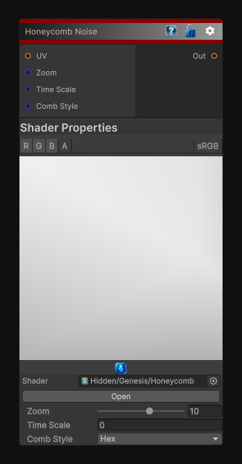

# Honeycomb Noise

> This file is auto-generated by `Documentation/Generate-GenesisNodeDocs.ps1`.

[Back to index](../../README.md) | [Back to Generators](../../generators.md)

## Snapshot

## Details

- Menu: `Generators/Noise/Honeycomb Noise`
- Node group: `Noise`
- Shader: `Hidden/Genesis/Honeycomb`
- Source: [Runtime/Nodes/Generator/Noise/HoneycombNoise.cs](../../../../Runtime/Nodes/Generator/Noise/HoneycombNoise.cs)

## Documentation

The Honeycomb node generates hexagonal and stara'shaped cellular patterns using a custom hasha'driven lattice evaluation.
It is ideal for:
- Stylized honeycomb textures
- Scia'fi hex grids
- Organic cellular patterns
- Decorative masks
- Pattern breakup
- UI backgrounds
- Animated hexa'based effects
The node supports two variants:
- Hex a" classic honeycomb
- Star a" stara'shaped hex cells with smoothed interpolation
Both variants are deterministic, tilea'free, and resolutiona'independent.
