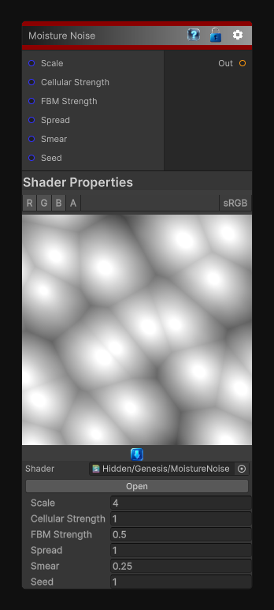

# Moisture Noise

> This file is auto-generated by `Documentation/Generate-GenesisNodeDocs.ps1`.

[Back to index](../../README.md) | [Back to Generators](../../generators.md)

## Snapshot

## Details

- Menu: `Generators/Noise/Moisture Noise`
- Node group: `Noise`
- Shader: `Hidden/Genesis/MoistureNoise`
- Source: [Runtime/Nodes/Generator/Noise/MoistureNoiseNode.cs](../../../../Runtime/Nodes/Generator/Noise/MoistureNoiseNode.cs)

## Documentation

It's not Perlin, not Worley, not Clouds - it's a hybrid pattern that looks like:
- Wet patches
- Water absorption
- Damp stains
- Organic spreading
- Soft cellular breakup
- Slight directional bias
