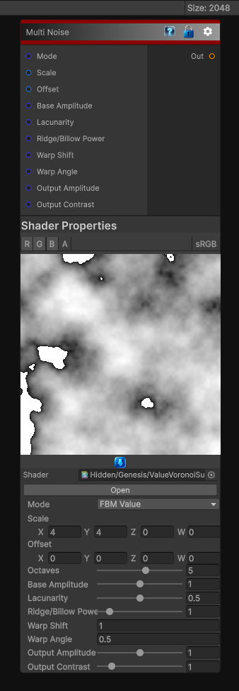

# Multi Noise

> This file is auto-generated by `Documentation/Generate-GenesisNodeDocs.ps1`.

[Back to index](../../README.md) | [Back to Generators](../../generators.md)

## Snapshot

## Details

- Menu: `Generators/Noise/Multi Noise`
- Node group: `Noise`
- Shader: `Hidden/Genesis/ValueVoronoiSuite2D`
- Source: [Runtime/Nodes/Generator/Noise/MultiNoiseNode.cs](../../../../Runtime/Nodes/Generator/Noise/MultiNoiseNode.cs)

## Documentation

Generates a variety of noise types based on a dropdown
