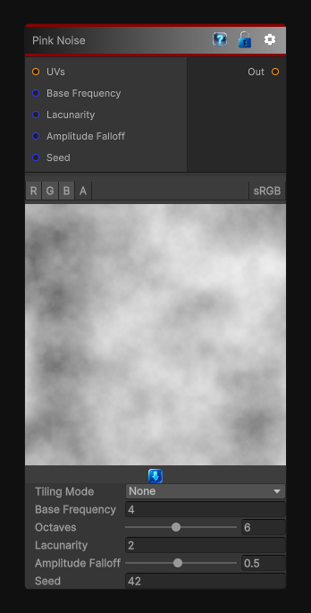

# Pink Noise

> This file is auto-generated by `Documentation/Generate-GenesisNodeDocs.ps1`.

[Back to index](../../README.md) | [Back to Generators](../../generators.md)

## Snapshot

## Details

- Menu: `Generators/Noise/Pink Noise`
- Shader: `Hidden/Genesis/PinkNoise`
- Source: [Runtime/Nodes/Generator/Noise/PinkNoise.cs](../../../Doxygen/html/_pink_noise_8cs_source.html)

## Documentation

The PinkNoise node generates deterministic, sampler-free pink noise in 2D, 3D, or Cube space.
Pink noise emphasizes broad, low-frequency variation while retaining fine detail, making it useful for:
- Terrain and cloud masks
- Organic breakup
- Weathering variation
- Soft clustered randomness
- Procedural material detail
The node supports frequency, octaves, lacunarity, amplitude falloff, seed, output range, tiling, custom UVs, and multi-channel evaluation.
