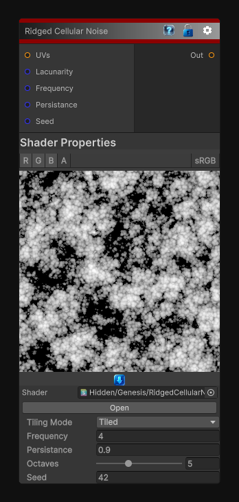

# Ridged Cellular Noise

> This file is auto-generated by `Documentation/Generate-GenesisNodeDocs.ps1`.

[Back to index](../../README.md) | [Back to Generators](../../generators.md)

## Snapshot

## Details

- Menu: `Generators/Noise/Ridged Cellular Noise`
- Node group: `Noise`
- Shader: `Hidden/Genesis/RidgedCellularNoise`
- Source: [Runtime/Nodes/Generator/Noise/RidgedCellularNoise.cs](../../../../Runtime/Nodes/Generator/Noise/RidgedCellularNoise.cs)

## Documentation

The RidgedCellularNoise node generates higha'contrast, ridgea'enhanced cellular noise in 2D, 3D, or Cube space.
It is built on top of GenesisaTM CellularNoise system but applies a ridging transform to produce:
- Sharp ridges
- Deep valleys
- Higha'frequency cellular breakup
- Stylized organic patterns
- Cracks, veins, and mineral structures
This makes it ideal for:
- Rock and stone materials
- Alien or organic surfaces
- Stylized terrain
- Cracks, veins, and branching patterns
- Mask generation
- Heightmap breakup
