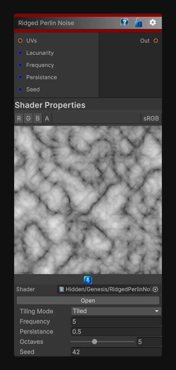

# Ridged Perlin Noise

> This file is auto-generated by `Documentation/Generate-GenesisNodeDocs.ps1`.

[Back to index](../../README.md) | [Back to Generators](../../generators.md)

## Snapshot

## Details

- Menu: `Generators/Noise/Ridged Perlin Noise`
- Node group: `Noise`
- Shader: `Hidden/Genesis/RidgedPerlinNoise`
- Source: [Runtime/Nodes/Generator/Noise/RidgedPerlinNoise.cs](../../../../Runtime/Nodes/Generator/Noise/RidgedPerlinNoise.cs)

## Documentation

The RidgedPerlinNoise node generates higha'contrast, ridgea'enhanced Perlin FBM noise in 2D, 3D, or Cube space.
It transforms classic Perlin FBM into a sharp, minerala'like, mountainous pattern by applying a ridging function:
\mathrm{ridge}(x)=1-|x|
This produces:
- Sharp peaks
- Deep valleys
- Higha'contrast fractal detail
- Stylized terrain and rock patterns
- Organic breakup masks
It is ideal for:
- Terrain heightmaps
- Stylized rock and stone
- Cracks and erosion masks
- Organic surface breakup
- Procedural materials
- Distortion field
