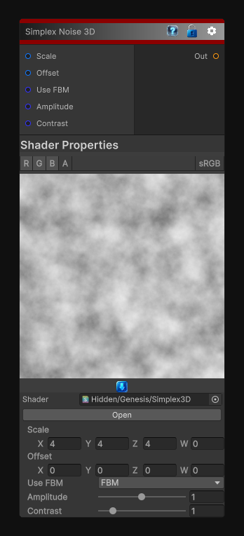

# Simplex Noise 3D

> This file is auto-generated by `Documentation/Generate-GenesisNodeDocs.ps1`.

[Back to index](../../README.md) | [Back to Generators](../../generators.md)

## Snapshot

## Details

- Menu: `Generators/Noise/Simplex 3D`
- Node group: `Noise`
- Shader: `Hidden/Genesis/Simplex3D`
- Source: [Runtime/Nodes/Generator/Noise/Simplex3DNode.cs](../../../../Runtime/Nodes/Generator/Noise/Simplex3DNode.cs)

## Documentation

The Simplex3D node generates 3D simplex noise or 3D simplex FBM depending on the selected mode.
It is a high-performance, deterministic implementation of IQ-style simplex noise, suitable for:
- Volumetric textures
- 3D procedural materials
- Clouds, fog, smoke
- Organic breakup
- Distortion fields
- Terrain and heightmap detail
- Animated noise (via Offset)
The node outputs a single-channel scalar noise value, shaped by amplitude and contrast.
