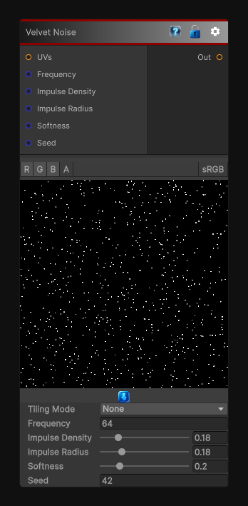

# Velvet Noise

> This file is auto-generated by `Documentation/Generate-GenesisNodeDocs.ps1`.

[Back to index](../../README.md) | [Back to Generators](../../generators.md)

## Snapshot

## Details

- Menu: `Generators/Noise/Velvet Noise`
- Shader: `Hidden/Genesis/VelvetNoise`
- Source: [Runtime/Nodes/Generator/Noise/VelvetNoise.cs](../../../Doxygen/html/_velvet_noise_8cs_source.html)

## Documentation

The VelvetNoise node generates deterministic, sampler-free velvet noise in 2D, 3D, or Cube space.
Velvet noise is a sparse field of random impulses, making it useful for:
- Fine grains and flecks
- Sparse stochastic masks
- Sampling impulse patterns
- Material speckle
- Procedural sparkle or grit
- Discontinuous breakup
The node supports frequency, impulse density, impulse radius, softness, seed, output range, tiling, custom UVs, and multi-channel evaluation.
