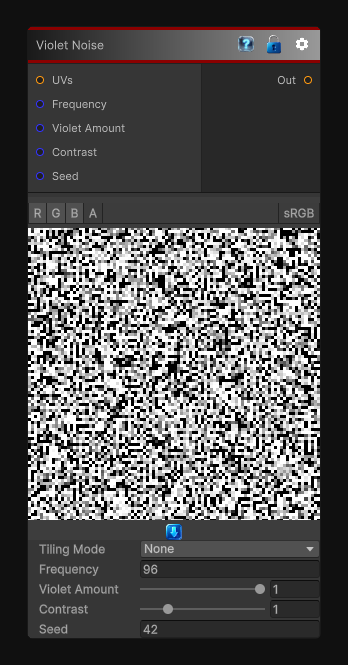

# Violet Noise

> This file is auto-generated by `Documentation/Generate-GenesisNodeDocs.ps1`.

[Back to index](../../README.md) | [Back to Generators](../../generators.md)

## Snapshot

## Details

- Menu: `Generators/Noise/Violet Noise`
- Shader: `Hidden/Genesis/VioletNoise`
- Source: [Runtime/Nodes/Generator/Noise/VioletNoise.cs](../../../Doxygen/html/_violet_noise_8cs_source.html)

## Documentation

The VioletNoise node generates deterministic, sampler-free violet-noise-style masks in 2D, 3D, or Cube space.
Violet noise emphasizes very high-frequency variation and suppresses broad structure more aggressively than blue noise, making it useful for:
- Fine dithering
- Stochastic sampling jitter
- High-detail procedural breakup
- Grain and shimmer masks
- Edge-like random texture detail
The node supports frequency, seed, output range, tiling, custom UVs, and multi-channel evaluation.
