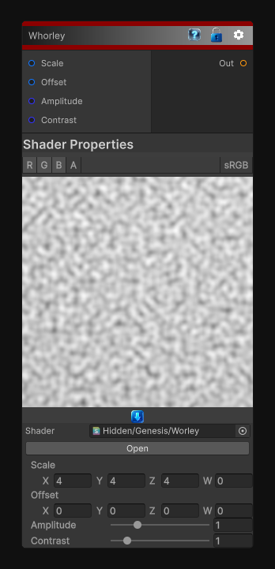

# Worley

> This file is auto-generated by `Documentation/Generate-GenesisNodeDocs.ps1`.

[Back to index](../../README.md) | [Back to Generators](../../generators.md)

## Snapshot

## Details

- Menu: `Generators/Noise/Worley`
- Node group: `Noise`
- Shader: `Hidden/Genesis/Worley`
- Source: [Runtime/Nodes/Generator/Noise/WorleyNode.cs](../../../../Runtime/Nodes/Generator/Noise/WorleyNode.cs)

## Documentation

The Worley node generates a hybrid procedural noise by combining:
- 2D Worley (cellular) FBM
- 3D Perlin noise
- A multiplicative fusion step
This produces a unique pattern that blends:
- Cellular structures
- Organic turbulence
- Soft fractal breakup
- Mineral-like textures
It is ideal for:
- Stone and rock materials
- Organic surfaces
- Terrain breakup
- Stylized shading
- Mask generation
- Cloudy or smoky patterns
The node outputs a single scalar noise value with amplitude and contrast shaping.